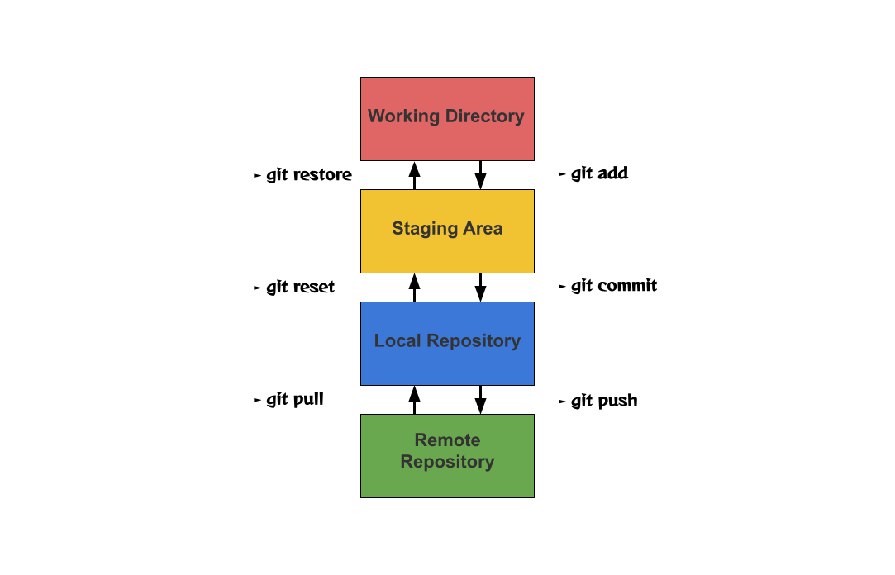

# 後端基礎學習

參考資源: [Willisの後端幼幼班](https://ithelp.ithome.com.tw/users/20151015/ironman/5137)

使用Flask架設網站

使用工具:
1. Python, Flask
2. MySQL
3. Visual Studio Code

---

## 筆記

---

### CMD指令

1. py --version -> 查看python版本
2. mkdir folder_name -> 建立資料夾
3. cd path -> 移動到路徑
4. code. -> 開啟VScode

### Python 學習

1. test.py -> main() -> 雙層巢狀迴圈用法

---

### Decorator 裝飾器

※ 參考 decorator.py
[參考資料](https://blog.typeart.cc/%E5%BF%AB%E9%80%9F%E7%90%86%E8%A7%A3%E4%B8%A6%E4%BD%BF%E7%94%A8Python%20Decorator/#%E5%89%8D%E8%A8%80)

規則:

    1. 使用decorator呼叫.__name__時，會變成decorator的名字，在debug時會難以查找問題。
    2. 需from functools import wraps，來重新指向，此為python原生功能，由decorator實現。
    3. 使用 Class-Based Decorator，就不用functools.wraps來重新指向.__name__
    4. 多個decorator使用時，執行順序"由下至上"，靠近的decorator先執行

方法:

    1. 不含參數的Class-Based Decorator, 設定__init__(sefl, func), func = 另一個function，
    並設定__call__內的指令，當成裝飾器使用時，會呼叫__call__裡面的指令
    2. 把裝飾器的參數寫在__init__裡面，另一個function寫在__call__裡面，並在__call__裡面新增一個wrapper(*args, **kwargs)，來代表被傳入的另一個function

### Call by value, Call by reference

簡述:

    1. Call by value: 把值複製傳進，在function裡修改，不影響外面傳入的值
    2. Call by reference: 把儲存該值的地址傳入，在function裡修改，會影響外面的值

裝飾器原理說明:

把function_a再包一層function，在執行function之前及之後，再多做些其他動作，比如記錄log、關開signals，
避免一直在各functions內部一直重複執行某些動作

裝飾器簡單步驟說明:

1. 先將myFunc傳入，此時尚未執行裡面的wrapper
2. return wrapper地址，因遇到@，執行wrapper()
3. 因使用@特殊執行，wrapper會接收myFunc本身的參數(*args,**kwargs)，接著開始執行收到的地址(即wrapper)
4. 在wrapper中執行到f(即myFunc)時，要記得把myFunc本身的參數還給他

### pipenv

1. pip install pipenv
2. mkdir project_folder
3. cd into project
4. pipenv --three -> python 3 (pipenv --two)
5. pipenv --python 3.10 -> python 3.10
6. pipenv shell (啟用虛擬環境)
7. exit (退出)
8. pipenv install __package_name__
9. pipenv uninstall __package_name__
10. pipenv graph ->查看虛擬環境安裝的套件及版本
11. pipenv --venv ->查看虛擬環境訊息
12. pipenv --rm ->刪除虛擬環境

### Git

Git 是一個分散式版本控制軟體，可以記錄所有的修改版本

1. working directory (工作目錄): 檔案狀態 : Untracked files(未追蹤)、Changes not staged for commit(已更改)
2. staging area (暫存區): 將變動及更改的檔案暫時存取的區域，Changes to be committed(等待提交)
3. local respository (本地儲存庫): 本地存儲檔案的倉庫，檔案狀態 : Committed(已提交)
4. remote repository (遠端儲存庫): 遠端存儲檔案的倉庫，檔案狀態 : Committed(已提交)

Git 指令

1. git config --global user.name your_name
2. git config --global user.email your_email
3. git config --list -> 查看使用者訊息，shift+Q離開
4. 遠端金鑰: ssh-keygen -t rsa -b 4096 -C your_email
   
   完成後會出現的訊息:
   :::success
    Enter file in which to save the key
    #金鑰存放位置
    Enter passphrase (empty for no passphrase):
    #設置通行密碼
    Enter same passphrase again:
    #再次輸入通行密碼
    :::

5. 接著移動到你存放金鑰的資料夾 .ssh 會發現裡面有兩個檔案，有副檔名 .pub 的代表是你的公鑰，沒有副檔名的檔案是私鑰。
6. 到[Github](https://github.com/)，Settings -> SSH and GPG keys -> New SSH key
7. open id_rsa.pub，notepad .ssh/id_rsa.pub
8. 把記事本的內容複製放進Key裡面，接著按下 Add SSH key(Title可寫可不寫)
9. ssh -T git@github.com (確認是否成功)
10. 成功訊息

    :::success
    Hi WillisJoker! You've successfully authenticated,
    but GitHub does not provide shell access.
    #成功訊息
    :::

11. Git建立: git init
12. 刪除Git -> rm -rf .git
13. git remote add origin git@github.com:repository_address.git -> 連結遠端倉庫
14. 查詢遠端連結 -> git remote -v
15. 查詢上傳狀態 -> git status
16. 加入追蹤全部檔案 -> git add .
17. 加入追蹤指定檔案 -> git add app.py
18. 提交暫存資料及說明 -> git commit -m "說明訊息"
19. 查看歷史紀錄 -> git log
20. 上傳檔案到遠端 -> git push origin master
21. 第一次使用Git時，git clone SSH_url
22. 主機與伺服器端同步更新，git pull origin master
23. Git 分支，查看所有 -> git branch
24. 建立分支 -> git branch 分支名稱
25. 切換分支 -> git checkout 分支名稱
26. 新建分支並切換 -> git checkout -b 分支名稱

### Flask

1. [配置管理](https://dormousehole.readthedocs.io/en/latest/config.html#TESTING)

2. 基本語法:
   
   1. from flask import Flask, url_for, redirect, render_template
   2. variable = Flask(\_\_name__)
   3. app.route('/url')
   4. def function
   5. return ...

3. request, method: GET, POST

   1. GET: 從指定的資源請求數據，提交參數會顯示在url
   2. POST: 向指定的資源提交要被處理的數據，透過表單，提交參數不會顯示在url (更隱密)

※ 登入頁面做法: 

    1. 設定@app.route("/"), function return render_template('login.html')
    2. 設定@app.route("/hello"), function return str, or request.args, form, values，獲取參數

## HTTP error

---

## Cookie

簡述: 網站為了辨別使用者身分而儲存在用戶端（Client Side）上的資料，使用Cookie能夠讓使用者在網路瀏覽上更加方便，但在網路隱私的方面來說Cookie危害了使用者的安全。